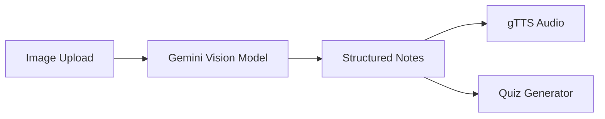

# 🚀 VoxNote-AI

### *AI-powered Vision → Notes → Voice → Quiz Pipeline*

<p align="center">
  
  
  
  
  
  
</p>

---

## 🌐 Live Demo

👉 **Try it now:** https://voxnote-ai.streamlit.app/

---

## ⚡ What This Project Does (10-sec view)

**VoxNote-AI converts note images into:**

* 🧠 **Structured AI Summary**
* 🔊 **Instant Voice Narration**
* 📚 **Auto-generated Quiz (3 difficulty levels)**

👉 All in one seamless pipeline.

---

## 🧩 Core Innovation

**Solves 2 key technical challenges:**

### 📸 Vision (Understanding Notes)

* Converts uploaded images → AI-readable format
* Handles multi-image inputs
* Extracts meaningful structured information

### 🔊 Vox (Voice Intelligence)

* Cleans AI-generated markdown
* Converts text → natural speech
* Streams audio in real-time

---

## 🏗️ Architecture (Simple View)



---

## 🛠️ Tech Stack (At a Glance)

* **Frontend:** Streamlit
* **AI Engine:** Google Gemini API
* **Image Handling:** PIL
* **Voice Engine:** gTTS
* **Config:** python-dotenv

---

## 📂 Project Structure

```bash
VoxNote-AI/
├── app.py              # UI Layer (Streamlit)
├── api_calling.py      # AI + Logic Layer
├── .env                # API Key (secured)
├── requirements.txt
└── README.md
```

---

## 🚀 Quick Start

```bash
git clone https://github.com/your-username/VoxNote-AI.git
cd VoxNote-AI
pip install -r requirements.txt

# Add API key
echo GEMINI_API_KEY=your_api_key_here > .env

streamlit run app.py
```

---

## 💡 Why This Project Stands Out

* ✅ Real-world **AI + UX integration**
* ✅ Handles **Vision + Voice pipeline end-to-end**
* ✅ Clean modular architecture
* ✅ Production-ready API handling

---

## 📈 Impact Potential

* 📚 Students → faster revision
* 🎓 Educators → auto content generation
* 🧠 EdTech → scalable AI learning tool

---

## 👤 Author

**Abdullah Al Mamun Zishan**
🔗 [www.linkedin.com/in/abdullah-al-mamun-zishan-606550282](http://www.linkedin.com/in/abdullah-al-mamun-zishan-606550282)

---

## ⭐ Final Impression

**VoxNote-AI = Vision Intelligence + Voice Interface + Learning Automation**

A compact demonstration of building **practical AI products**, not just models.
